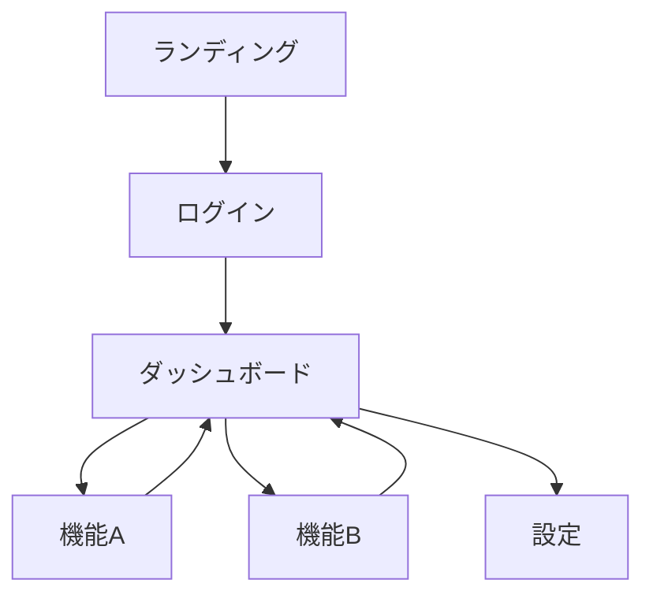
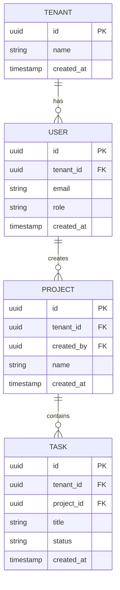

# 設計ガイド（DESIGN-GUIDE v1.0）

DEV-RULES Phase 2 の詳細ガイド。
要件定義が終わったら、このドキュメントで「どう作るか」を決める。

---

## 1. 技術スタック選定

> なぜ必要？：後から変更するとコスト激増。最初に決めて固定する。

### 選定基準

| 観点 | 質問 |
|------|------|
| 学習コスト | 自分（またはチーム）が使えるか？ |
| 実績 | 同規模のプロダクトで使われているか？ |
| コスト | 無料枠で検証できるか？スケール時の費用は？ |
| AI対応 | Cursor / Claude が得意な技術か？ |

### 記入欄

```
【フロントエンド】
- 技術：
- 選定理由：

【バックエンド】
- 技術：
- 選定理由：

【データベース】
- 技術：
- 選定理由：

【認証】
- 技術：
- 選定理由：

【インフラ】
- 技術：
- 選定理由：

【決済】（必要な場合）
- 技術：
- 選定理由：
```

### 迷ったときの推奨スタック（2025年版）

| 用途 | 推奨 | 理由 |
|------|------|------|
| フロント | Next.js / React | AI生成コードの精度が高い |
| バックエンド | Next.js API Routes / Hono | フロントと統合しやすい |
| DB | Supabase / Turso | 無料枠が広い、RLS対応 |
| 認証 | Supabase Auth / Better Auth | 実装が楽 |
| インフラ | Vercel / Cloudflare | デプロイが簡単 |
| 決済 | Stripe | 日本円対応、ドキュメント充実 |

---

## 2. 画面設計

> なぜ必要？：作る前に全体像を把握する。抜け漏れを防ぐ。

### 2.1 画面一覧

```
【画面一覧】
| No | 画面名 | URL | 認証 | 説明 |
|----|--------|-----|------|------|
| 1 | | | 要/不要 | |
| 2 | | | 要/不要 | |
| 3 | | | 要/不要 | |
| 4 | | | 要/不要 | |
| 5 | | | 要/不要 | |
```

### 2.2 画面遷移図

> なぜ必要？：ユーザーの動線を可視化。行き止まりや迷子を防ぐ。

```
【メインフロー】
ランディングページ
    ↓
ログイン/新規登録
    ↓
ダッシュボード
    ↓
機能A → 完了画面 → ダッシュボードに戻る
```

### 記入欄（Mermaid形式推奨）



### チェックポイント
- [ ] 全画面に「戻る」動線があるか
- [ ] 認証が必要な画面が明確か
- [ ] エラー時の遷移先が決まっているか

---

## 3. データ設計

> なぜ必要？：DBスキーマは後から変更が困難。最初にしっかり設計。

### 3.1 ER図

```
【主要エンティティ】
- 
- 
- 

【リレーション】
- 〇〇 は △△ を複数持つ（1:N）
- 〇〇 と △△ は多対多（M:N）
```

### 記入欄（Mermaid形式推奨）



### 3.2 テーブル定義

```
【テーブル名】users
| カラム名 | 型 | NULL | 説明 |
|---------|-----|------|------|
| id | uuid | NO | PK |
| tenant_id | uuid | NO | FK: tenants.id |
| email | varchar | NO | ユニーク |
| role | varchar | NO | owner/admin/member |
| created_at | timestamp | NO | |

【テーブル名】
| カラム名 | 型 | NULL | 説明 |
|---------|-----|------|------|
| | | | |
```

### 必須ルール（DEV-RULES準拠）
- [ ] 全テーブルに `tenant_id` がある（マルチテナント対応）
- [ ] 全テーブルに `created_at` がある
- [ ] 論理削除する場合は `deleted_at` を使う
- [ ] RLS（Row Level Security）を設定する前提で設計

---

## 4. API設計

> なぜ必要？：フロントとバックの契約書。これがブレると全部壊れる。

### 4.1 エンドポイント一覧

```
【API一覧】
| メソッド | パス | 認証 | 説明 |
|---------|------|------|------|
| GET | /api/projects | 要 | プロジェクト一覧取得 |
| POST | /api/projects | 要 | プロジェクト作成 |
| GET | /api/projects/:id | 要 | プロジェクト詳細取得 |
| PUT | /api/projects/:id | 要 | プロジェクト更新 |
| DELETE | /api/projects/:id | 要 | プロジェクト削除 |
| | | | |
```

### 4.2 API詳細（主要なものだけ）

```
【エンドポイント】POST /api/projects

【リクエスト】
{
  "name": "string",
  "description": "string"
}

【レスポンス（成功）】
{
  "id": "uuid",
  "name": "string",
  "created_at": "timestamp"
}

【レスポンス（エラー）】
{
  "error": "string",
  "code": "string"
}

【権限】
- owner: ✅
- admin: ✅
- member: ❌
```

### 設計原則
- RESTful に従う（リソース名は複数形）
- 認証が不要なエンドポイントは最小限に
- エラーレスポンスの形式を統一

---

## 5. 認可設計

> なぜ必要？：「誰が何をできるか」が曖昧だとセキュリティホールになる。

### 5.1 ロール定義

```
【ロール一覧】
| ロール | 説明 | 想定ユーザー |
|--------|------|-------------|
| owner | 全権限 | 契約者、経営者 |
| admin | ユーザー管理以外の全権限 | 管理者 |
| member | 閲覧と自分のデータ編集のみ | 一般ユーザー |
```

### 5.2 権限マトリクス

```
【権限マトリクス】
| リソース | 操作 | owner | admin | member |
|---------|------|-------|-------|--------|
| プロジェクト | 作成 | ✅ | ✅ | ❌ |
| プロジェクト | 閲覧 | ✅ | ✅ | ✅ |
| プロジェクト | 編集 | ✅ | ✅ | ❌ |
| プロジェクト | 削除 | ✅ | ❌ | ❌ |
| ユーザー | 招待 | ✅ | ❌ | ❌ |
| ユーザー | 削除 | ✅ | ❌ | ❌ |
| | | | | |
```

### 5.3 マルチテナント境界

```
【テナント分離ルール】
- 全クエリに tenant_id 条件を必須とする
- owner でも他テナントのデータは閲覧不可
- API レイヤーで tenant_id をセッションから取得（リクエストから受け取らない）

【実装方針】
- [ ] RLS（Row Level Security）を使用する
- [ ] または、全クエリに tenant_id フィルタを強制するミドルウェアを実装
```

---

## 6. セキュリティ設計

> なぜ必要？：後付けセキュリティはコストが10倍。最初から組み込む。

### 6.1 認証方式

```
【認証方式】
- [ ] メール + パスワード
- [ ] ソーシャルログイン（Google / GitHub / etc）
- [ ] マジックリンク
- [ ] その他：

【セッション管理】
- 方式：JWT / Cookie Session
- 有効期限：
- リフレッシュ方式：
```

### 6.2 認証なしエンドポイント

```
【認証不要エンドポイント一覧】
| パス | 理由 |
|------|------|
| / | ランディングページ |
| /login | ログイン画面 |
| /signup | 新規登録画面 |
| /api/auth/* | 認証系API |
| | |

※ 上記以外は全て認証必須
```

### 6.3 外部APIキー管理

```
【使用する外部サービス】
| サービス | 用途 | 上限設定 |
|---------|------|---------|
| OpenAI | | 月額 $XX |
| Stripe | | - |
| | | |

【管理方針】
- 環境変数で管理（.env）
- 本番キーはCI/CDの環境変数に設定
- ローテーション頻度：
```

---

## 7. 非機能要件

> なぜ必要？：機能だけでは「使えるプロダクト」にならない。

```
【パフォーマンス】
- 画面表示：X秒以内
- API応答：X秒以内
- 同時接続数：X人

【可用性】
- 目標稼働率：XX%
- メンテナンス窓口：

【スケーラビリティ】
- 初期想定ユーザー数：
- 1年後想定ユーザー数：
- スケール方針：

【バックアップ】
- 頻度：
- 保持期間：
- リストア手順：
```

---

## 8. 設計チェックリスト

最終確認用。全部チェックできたらPhase 3へ。

### 技術スタック
- [ ] 全レイヤーの技術が決まっている
- [ ] 選定理由が説明できる
- [ ] 無料枠 or 予算内で収まる

### 画面設計
- [ ] 全画面が一覧化されている
- [ ] 画面遷移図がある
- [ ] 認証要否が明確

### データ設計
- [ ] 主要テーブルが定義されている
- [ ] 全テーブルに tenant_id がある
- [ ] リレーションが明確

### API設計
- [ ] エンドポイント一覧がある
- [ ] 主要APIのリクエスト/レスポンスが定義されている
- [ ] 認証要否が明確

### 認可設計
- [ ] ロールが定義されている
- [ ] 権限マトリクスがある
- [ ] テナント分離方針が決まっている

### セキュリティ設計
- [ ] 認証方式が決まっている
- [ ] 認証不要エンドポイントが一覧化されている
- [ ] 外部APIキーの管理方針が決まっている

---

## 変更履歴

| バージョン | 日付 | 変更内容 |
|-----------|------|---------|
| v1.0 | 2026-01-04 | 初版作成 |

---

設計完了 → `DEV-RULES.md` Phase 3（開発）へ
